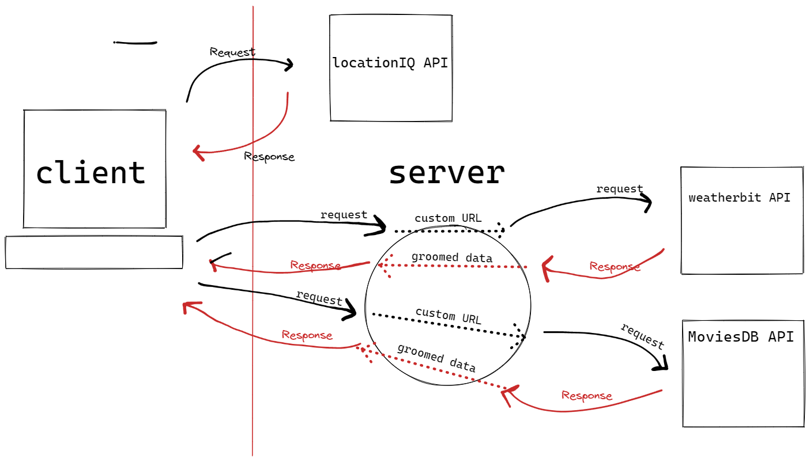
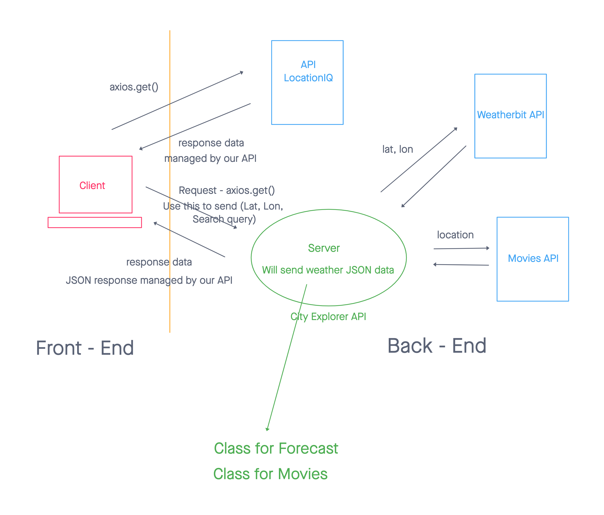
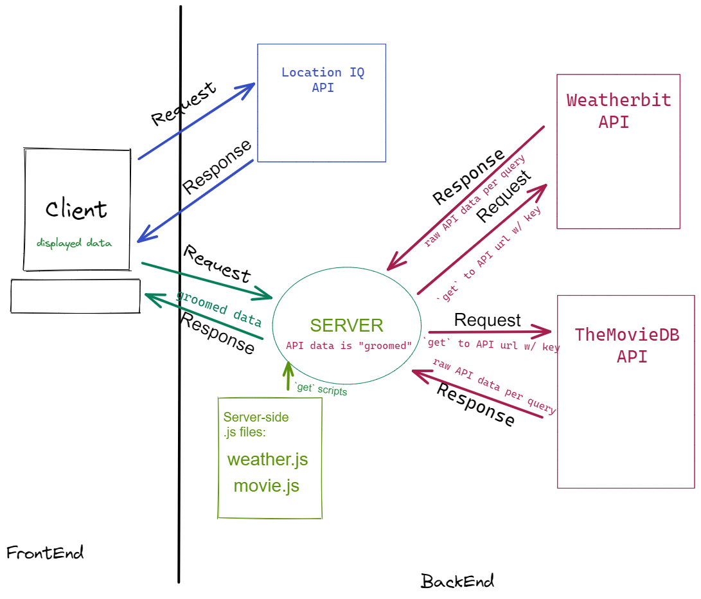

# City Explorer 

**Author**: Hambalieu Jallow
 <b/r>

# Overview:
- Building a React application that uses the Axios library to make user-initiated requests for data from a thrid-party API.
- Modularizing JavaScript files on the back-end allows us to re-use functions and makes our code more readable. Clean up your back-end codebase by modularizing your server.js.
- Every web site is essentially a set of nested components. Update your UI to make the best use of components to create your page.

&nbsp;

## Feature 1 and Steps

## Lab 9

- Remove the weather functionality from the `server.js` and place it in its own `weather.js` file. Bring that component into your `server.js` file and ensure that your server is functioning as expected before moving on.
- Remove the movie functionality from the `server.js` and place it in its own `movies.js` file. Bring that component into your `server.js` file and ensure that your server is functioning as expected before moving on.
- Within your Weather component, create a nested component, `WeatherDay`, to render a single day's forecast. Map over the result to convert the raw response data into an array of these components.
- Within your `Movies` component, create a nested `Movie` component for rendering of each individual movie object found in the raw response data.
- Review the rest of your codebase. Further componentize any other aspects of the UI, as appropriate.
- Deploy your changes to production.

&nbsp;

>REACT_APP_LOCATIONIQ_ACCESS_TOKEN=<location of key access token>

## Paired with Shane to create this WRRC Images below:
   

&nbsp;

## Collaborators
- Riva looked at my PR and suggested some changes that I needed to make on my App.

&nbsp;

## Site Deployment  Link
- [https://hambalieucityexplorer.netlify.app/](https://hambalieucityexplorer.netlify.app/)  

## Site Deployment  Link>
-  [https://trello.com/b/oKobI6sh/city-explorer](https://trello.com/b/oKobI6sh/city-explorer)
