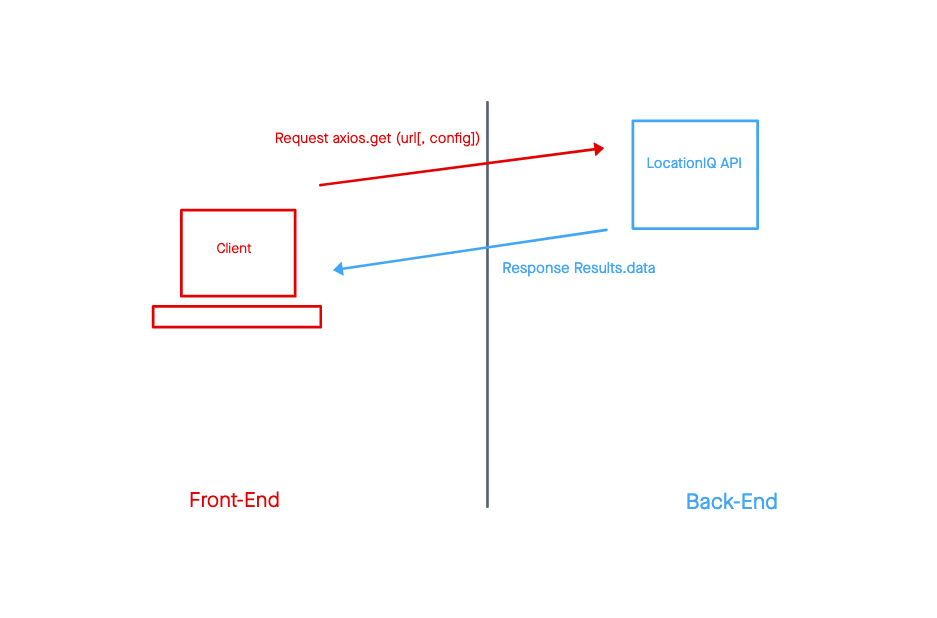

# City Explorer 

**Author**: Hambalieu Jallow
 <b/r>
# Overview:
- Building a React application that uses the Axios library to make user-initiated requests for data from a thrid-party API.
- Given that a user enters a valid location in the input.
When the user clicks the "Explore!" button.
Then the latitude and longitude will be displayed on the page
- Given that a user enters a valid location in the input.
When the user clicks the "Explore!" butto.
Then the map of the city is displayed on the page.
- Given that a user does not enter a valid location (eg: empty string) in the input
When the user clicks the "Explore!" button
Then the user will receive an error message on the page and the data will not be rendered properly

&nbsp;

## Feature 1 and Steps

- Created a new repo called `city-explorer` on GitHub, initialized with no files.
- Use `create-react-app` to setup a new React application named `city-explorer` in your local projects directory. 
- Connect my GitHub repo to my local repo using the directions on GitHub.
- Add a `.gitignore` file with React configurations, including ignoring of `.env`.
- Create a `package.json` file with all dependencies and any associated details related to configuration. The dependencies needed for today's lab include: Axios and Bootstrap.
- Procure a LocationIQ free-tier account. From the Dashboard, navigate to your API Access Tokens page. View, then Update the existing token, to change the label to "City Explorer".
- MOST IMPORTANTLY: Add your deployed Netlify app url as an HTTP Referrer to your API token settings. This step is necessary to prevent any unauthorized use of your token. Also add `localhost` while testing from your development environment.
- Create an `.env` file: Your API key goes here for local development. Make sure this file is in your `.gitignore`.
- Build a form to collect a city name from the user. Give the submit button the text of "Explore!".
- Use the data from the form to query LocationIQ for the latitude and longitude of the requested city. 
- Update the page with the returned `display_name`, `latitude`, and `longitude`, displayed nicely in an appropriate Bootstrap component. 
- After latitude and longitude values are retrieved, use those values to craft the URL for a map image. 
- Display the map image using appropriate Bootstrap components.
- Create an appropriate Bootstrap component that only renders if you hit an error with any API call.
- When an error occurs, display the status code and an error message to the user.
- Deploy my updated React app to Netlify by committing and pushing my code to my open pull request on GitHub. 

&nbsp;

>REACT_APP_LOCATIONIQ_ACCESS_TOKEN=<location of key access token>

## Paired with Shane to create this WRRC Images below:
   

&nbsp;

## Collaborators
- Riva and Shane looked at my PR and suggested some changes that I needed to make on my App.
- I collaborated with kevin and chuck to get the weather info to render on the App;

&nbsp;

## Site Deployment  Link
- [https://hambalieucityexplorer.netlify.app/](https://hambalieucityexplorer.netlify.app/)

-  [https://trello.com/b/oKobI6sh/city-explorer](https://trello.com/b/oKobI6sh/city-explorer)
